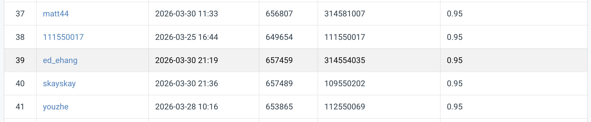

# NYCU Computer Vision 2026 HW1

**Student ID:** [314554035]  
**Name:** [張翊鞍]  

## Introduction
This repository contains the implementation for NYCU 2026 Spring Computer Vision Homework 1: Image Classification. 

The final solution utilizes a **ResNet-101** backbone (initialized with `IMAGENET1K_V2` weights) combined with a custom Multi-Layer Perceptron (MLP) classification head (`Linear` -> `BatchNorm1d` -> `GELU` -> `Dropout` -> `Linear`). To improve model robustness and generalization, the training pipeline incorporates advanced data augmentation techniques, including **RandAugment**, **MixUp**, and **CutMix**. 

During inference, **10-Crop Test Time Augmentation (TTA)** is applied to average the predictions across multiple crops, further boosting the final accuracy. The final best-performing model is trained using a full fine-tuning strategy from Epoch 1 (`train.py`).

## Environment Setup
It is recommended to use Python 3.9 or higher with a virtual environment (e.g., Conda, Poetry, or Virtualenv).

To install the required dependencies, run:
```bash
pip install -r requirements.txt
```

## Usage

### Dataset Preparation
Please ensure the dataset is placed in the root directory under the `./data` folder with the following structure:
```text
.
├── data/ 
│   ├── train/
│   ├── val/
│   └── test/
```

### Training
To train the final model (Full fine-tuning with BatchNorm + GELU head), execute the following command:
```bash
python train.py
```
* The training script will automatically save the best model weights as `best_resnet101_full_ft.pth`.


### Inference
To run inference on the test set using the trained weights and generate the submission file, execute:
```bash
python inference.py
```
* The script will load `best_resnet101_full_ft.pth` and output the predictions to `prediction_resnet101_full_ft.csv`.
* Inside the zipped submission file, this CSV will be renamed to `prediction.csv` as required by the CodaBench platform.

## Performance Snapshot
